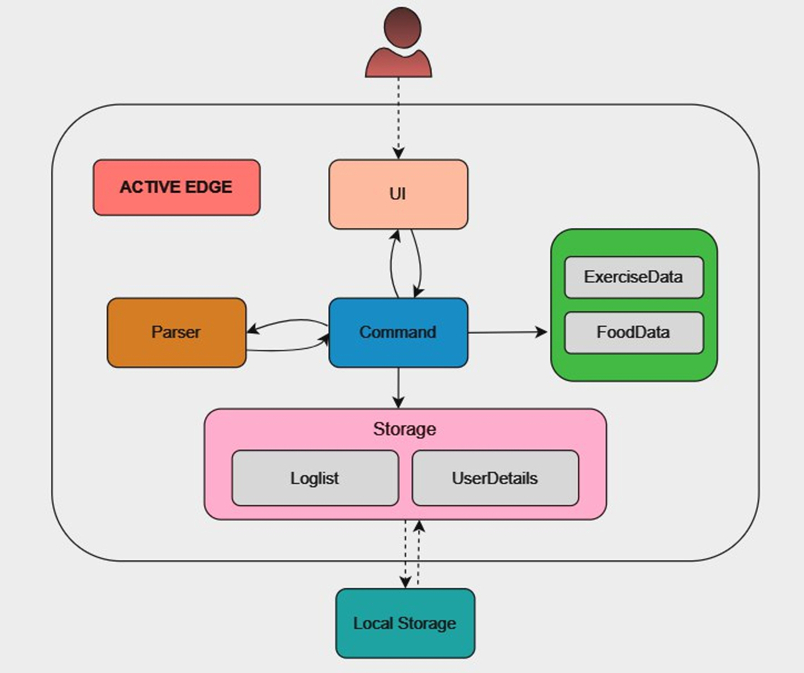
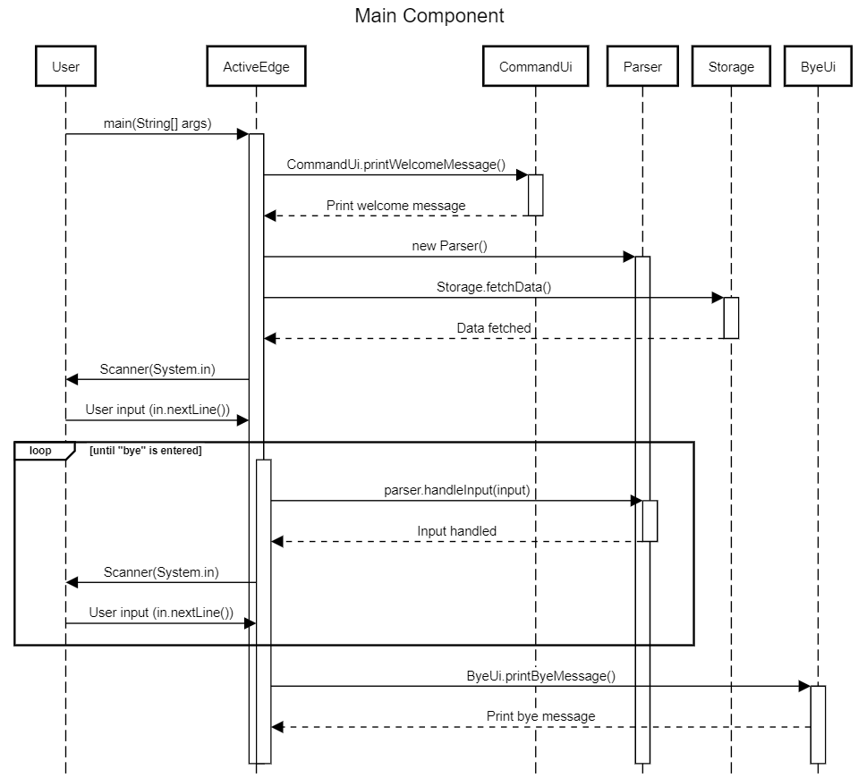
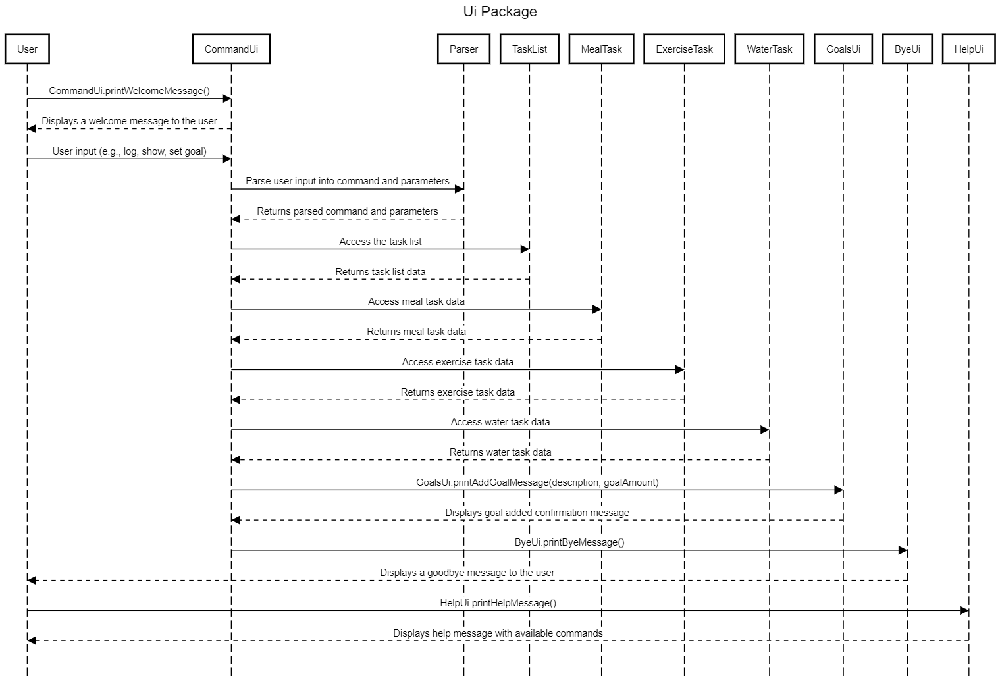

# ActiveEdge Developer Guide 🥦🏃‍♂️

## Introduction
**ActiveEdge** is a program for a university students to manage their food intake, water intake and exercises via the Command Line Interface (CLI).

## Quick Start

To get started quickly with ActiveEdge,
follow these simple steps:

1. Ensure that you have Java 11 or above installed.
2. Down the latest version of `ActiveEdge` from [here](http://link.to/duke). 
3. Copy the file into the folder you want to use as the home folder for your ActiveEdge.
4. Open a command terminal, cd into the home folder you put the jar file in, and run the following command: java -jar ActiveEdge.jar. You should see a welcome screen.
5. Type commands beside >>> and press Enter to execute it.
(e.g. typing ```help``` and pressing Enter will show the help page).
## Design & implementation 🏹  
### System Architecture



The Architecture Diagram above shows a high-level overview of the architectural design of ActiveEdge.

Active Edge is comprised of 8 major components:

```Main```: The entry point of the application.\
```UI```: A package responsible for handling user interactions, both capturing input and displaying output.\
```Parser```: A package that analyzes and interprets the user's input commands.\
```Command```: A package tasked with executing specific actions based on the user's commands.\
```Storage```: A package focused on persisting and retrieving all relevant data from the application's local storage system, ensuring data continuity and integrity.\
```LogList```: Maintains logged data throughout the application's runtime.\
```FoodData```: Active Edge's food database\
```ExerciseData```: Active Edge's exercise database\
### Generic Sequence Diagram
The generic sequence diagram provides a visual representation of the interactions between various components within the
ActiveEdge application. It illustrates how user commands are parsed, executed, and interact with different modules such
as user interface, data storage, and task management.


### Parser
The Parser components can be found within the Parser package.
It is responsible for parsing the input String of the user, and returning an appropriate XYZCommand class.
If the input is invalid, it throws exceptions to the Error package for error handling.
The Parser Class Diagram below shows how Execute, Parser, Error, Command classes of their respective packages work together.

### Storage
Storage is the main class responsible for file operations and data management.
UserDetailsList, LogHeight, and LogWeight handle user details such as height and weight logs.
TaskList manages various types of tasks including goals, meals, water intake, and exercises.
GoalTask, MealTask, WaterTask, and ExerciseTask are specific task types with their attributes.
AddBMICommand, AddHeightCommand, and AddWeightCommand are commands for adding BMI, height, and weight respectively.
The relationships depicted in the diagram are primarily composition and inheritance:

Storage has composition relationships with UserDetailsList and TaskList as it manages instances of these classes.
UserDetailsList and TaskList have a composition relationship with their respective contained classes (LogHeight, LogWeight, GoalTask, MealTask, WaterTask, ExerciseTask) 
as they hold lists of instances of these classes. AddBMICommand, AddHeightCommand, and AddWeightCommand are standalone commands 
used within the Storage class but don't directly interact with the other classes in the diagram.

### Main Component
The ActiveEdge class serves as the main entry point for the ActiveEdge application, handling user input parsing and interaction through a command-line interface.


### UI Package
The activeedge.ui package encapsulates the user interface components of the ActiveEdge application, facilitating interactions such as printing welcome messages, 
logging meal and exercise data, displaying goal information, providing help instructions, and managing user queries and commands for health tracking and goal setting.


Under commands, there are 17 sub-components:
```AddBMICommand```: A command responsible for calculating and adding Body Mass Index (BMI) information.
```AddGoalsCommand```: A command responsible for users to set and track their fitness goals.
```AddHeightCommand```: A command responsible for users to input and track their height information for comprehensive health tracking.
```AddWeightCommand```: A command responsible for users to input and track their weight measurements to monitor their progress and achievements.
```ClearCommand```: A command responsible for users to clear or delete entries, such as meals, from their tracking history.
```DeleteTaskCommand```: A command responsible for users to delete or remove exercise tasks.
```FindCommand```: A command responsible for users to search specific keywords.
```ShowSummaryCommand```: A command responsible for users to view a summary or overview of their calorie intake,calorie burnt during exercise .
```ViewWaterIntakeCommand```: A command responsible for users to view and track their water intake levels.

{Describe the design and implementation of the product. Use UML diagrams and short code snippets where applicable.}


## Product scope
### Target user profile 

Our target user profile primarily consists of NUS university students, including fitness enthusiasts, 
athletes adhering to strict dietary regimens, and individuals aiming to adopt a healthier lifestyle. 
These students are often juggling academic commitments, extracurricular activities, and social obligations, 
leaving little time for comprehensive meal planning and exercise routines. They recognize the importance 
of maintaining a balanced diet and engaging in regular physical activity to support their overall well-being,
but struggle to find the time and resources to effectively manage their fitness goals. By providing a 
convenient solution for tracking calorie intake and exercise routines tailored to their individual height 
and weight, our application aims to empower these busy students to make informed decisions about their 
nutrition and fitness. Through personalized guidance and easy-to-use features, we strive to assist them 
in achieving their fitness objectives while navigating the challenges of university life.

### Value proposition

**Comprehensive Health Tracking:** Users can log various aspects of their health, including meals, water intake, exercise activities, height, and weight. This comprehensive tracking enables users to maintain a holistic view of their health behaviors.

**Goal Setting and Monitoring:** The application allows users to set personalized goals for calorie intake, water consumption, and other health-related metrics. Users can track their progress towards these goals over time, fostering motivation and accountability.

**Customized Logging:** Users can log specific details about their meals, exercise routines, and water intake, providing granular insights into their health habits. This customization allows for tailored tracking based on individual preferences and requirements.

**Error Handling and User Guidance:** The application includes error handling mechanisms and user guidance to ensure smooth interaction and data input. This feature enhances user experience by reducing frustration and confusion during usage.

**Data Persistence and Accessibility:** The application stores user data securely, allowing for easy access and retrieval across multiple sessions. This ensures that users can review their health history and progress over time, facilitating informed decision-making and goal adjustment.

**Clear User Interface:** The user interface of the application is designed to be intuitive and user-friendly, enabling users to navigate and interact with the app effortlessly. This simplicity enhances user engagement and satisfaction with the overall experience.


## User Stories

| Version | As a ... | I want to ... | So that I can ...|
|---------|----------|---------------|------------------|
| v1.0    |new user|see usage instructions of the app|refer to them when I forget how to use the application|
| v1.0    |returning user|see my previous logs|see my daily logs and progress|
| v1.0    |user|log calorie intake|record daily consumption to monitor deitary habits|
| v1.0    | user|Log water intake|Track hydration levels throughout the day|
| v2.0    |user|Search for keywords|Quickly find specific information or entries within logs|
| v2.0    |user|	Delete entries from log|	Remove incorrect or unnecessary data from records|
| v2.0    |user|log exercises|keep track of my physical activities|
| v2.0    |user|View daily summary|Access a summary of exercise, nutrition, and hydration for the day|
| v2.0    |new user|log in my height and weight|see what range my weight is in|


## Non-Functional Requirements

{Give non-functional requirements}

## Glossary

* *glossary item* - Definition

## Instructions for manual testing

{Give instructions on how to do a manual product testing e.g., how to load sample data to be used for testing}

## Command Summary

| Action                                                | Format   |
|-------------------------------------------------------|----------|
| Getting help                                          | `help`   |
| Adding entries for meals                              | `log m/<MEAL_NAME> s/<SERVINGS>` |
| Adding entries for water                              | `log w/<AMOUNT_OF_WATER>` |
| Adding entries for exercises                          | `exercise <EXERCISE_NAME> d/<DURATION>` |
| Showing daily summary of food, water intake and goals | `summary` |
| Setting daily calories goal           | `set goal c/<CALORIE AMOUNT>`           |
| Setting daily water goal              | `set goal w/<WATER AMOUNT>`             |
| View daily calorie goal               | `show c`                                |
| View daily water goal                 | `show w`                                |
| View daily goals                      | `show g`                                |
| Adding entries for meals              | `log m/<MEAL_NAME> s/<SERVINGS>`        |
| Adding entries for water              | `log w/<AMOUNT_OF_WATER>`               |
| Adding entries for exercises          | `log e/<EXERCISE_NAME> d/<DURATION>` |
| View all entries for meals logged     | `list meals`                            |
| View all entries for water logged     | `list water`                            |
| View all entries for exercises logged | `list exercises`                        |
| View all entries logged               | `list`                                  |
| Getting help                          | `help`                                  |
| Find entries that contain the keyword | `find <KEYWORD>`                        |
| Prints all food data                  | `show food`                             |
| Prints all exercise data              | `show exercises`                        |
| Deletes the water/meal entry          | `delete <AMOUNT_OF_WATER>/<MEAL_NAME>`  |
| Clears all entry                      | `clear`
| Adding new items to the food database and log meal         | `add m/<MEAL_NAME> c/<CALORIES_PER_SERVING(kCal)> s/<NUMBER_OF_SERVINGS>` |


## Acknowledgements

{list here sources of all reused/adapted ideas, code, documentation, and third-party libraries -- include links to the original source as well}
